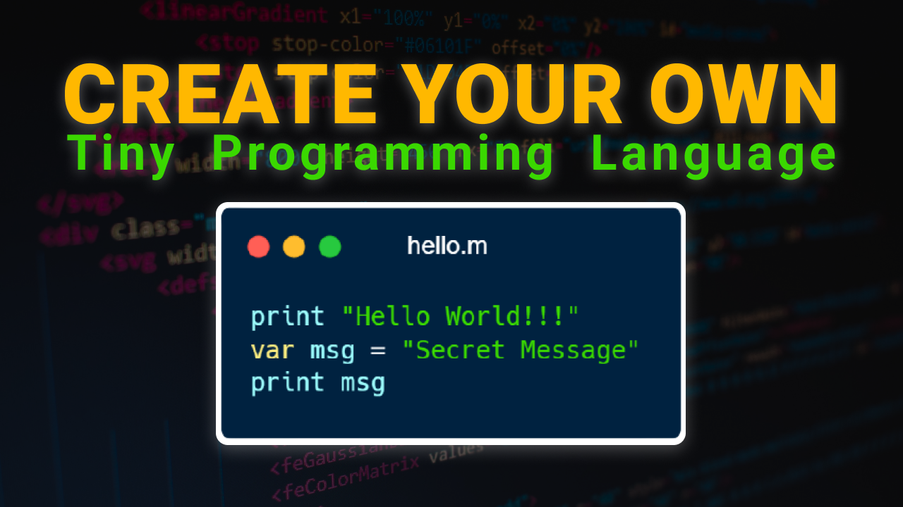

# Magenta
### Very Tiny Programming Language, that can print stuff to the console.


## Features
- Declare variables
- Print Strings
- Print Variables

## Example
```js
const codes = 
`print "hello world"
var msg = "secret message"
print msg`
const magenta = new Magenta(codes)
magenta.run()
```


*Tutorial Available on* [YouTube](https://www.youtube.com/watch?v=tb3eIEFgvKQ)
[](https://www.youtube.com/watch?v=tb3eIEFgvKQ)